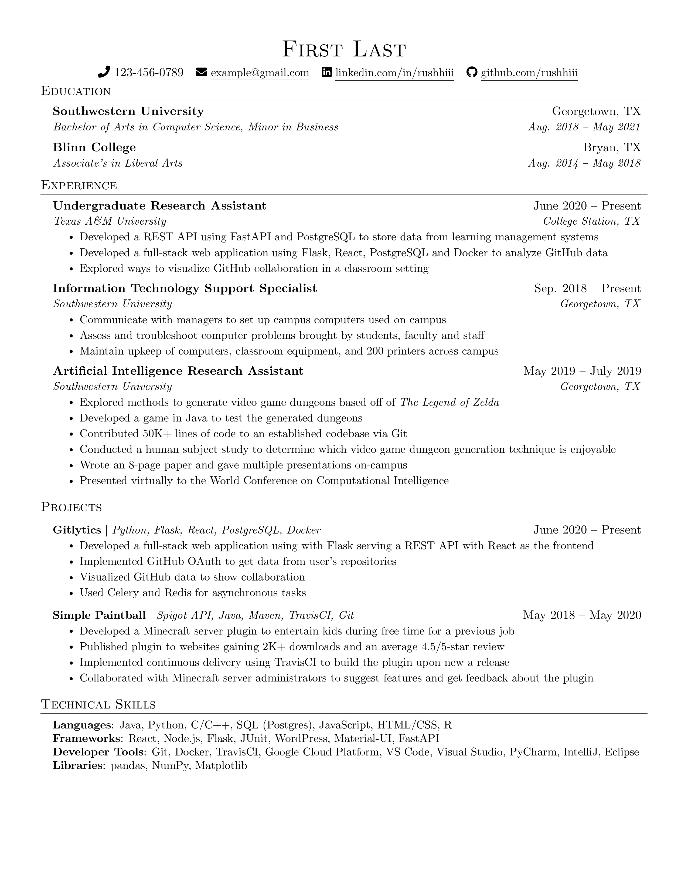

# Computer Science Resume Template

This repository contains files and links for LaTeX resume template to built a professional computer science resume. This templates are designed to highlight technical skills, project experience, and achievements in a clean and organized format.

## Overview

### Features
- Clean and modern design.
- Easy to customize and tailor for different job applications.
- Sections for technical skills, work experience, projects, and education.
- Structured layout to emphasize key information.

### Famous Templets
- [Jake](https://www.overleaf.com/latex/templates/jakes-resume-anonymous/cstpnrbkhndn) \ CS Resume Template
- [harshibar](https://www.overleaf.com/latex/templates/harshibars-resume/sbcyynmtpnyd) \ A simple one-page resume adapted from Jake's Resume.
- [Whemoon Jang](https://www.overleaf.com/latex/templates/brutal-resume/bksyyybqbhsy) \ brutal-resume - extremely slim Latex resume template
- [Jake Gutierrez](https://www.overleaf.com/latex/templates/jakes-resume/syzfjbzwjncs) \ A simple, straight-forward resume template
- [Sidney Hann](https://www.overleaf.com/articles/sidney-hanns-resume/wzmvhxpyskxv) \ Sidney Hann's résumé
- [Vaishanth R](https://www.overleaf.com/latex/templates/resume-professional-template-software-engineer/ttwtyxskrcsz) \ Resume Professional Template - Software Engineer.
- [Matty](https://www.overleaf.com/latex/templates/mattys-resume/hsfvwkkqxyfy) \ Jake's Resume alternative for students
- [Santiago](https://www.overleaf.com/latex/templates/first-year-resume-template-for-cs/sdmvdsgzxpwy) \ First year resume template for CS -Resume template for students with little to no experience, based on the ModernCV template.
  
> Didn't find what you were looking for, check out this [link](https://www.overleaf.com/latex/templates?q=resume) to search for more templets.  

### Example
- how [main.tex](https://raw.githubusercontent.com/rushhiii/Latex-Resume-Template/refs/heads/main/main.tex?token=GHSAT0AAAAAADGLHNDY523B7EONJVGQP52U2DI5QQA) looks like after compiling it.
<!--  -->


## How to Use

1. **Prerequisites:** Install LaTeX distribution (e.g., TeX Live, MiKTeX), or create an Overleaf account (Free).

2. **Clone or Fork this Repository:**

    ```bash
    git clone https://github.com/rushhiii/Latex-Resume-Template.git
    cd Latex-Resume-Template
    ```
    - if dont want to install LaTeX distribution locally, you can simply copy paste [`main.tex`](./https://github.com/rushhiii/Latex-Resume-Template/blob/7fc0b1a18ba38837eda35dc2b22aa88209b0c1a7/main.tex) code into Overleaf or use the links above!
  
3. **Edit the Resume:**

    - Open `main.tex` in your preferred LaTeX editor.
    - Customize the content under each section (skills, experience, projects, education) according to your own details.
    - Modify the styling, fonts, or colors as needed.

4. **Compile the Resume:**

    - Compile the LaTeX file (`main.tex`) using your LaTeX distribution.
    - This will generate the PDF output (`resume.pdf`) with your updated resume.

5. **Preview and Print:**

    - Review the `resume.pdf` to ensure everything appears as expected.
    - Print or save the PDF to share with potential employers.
